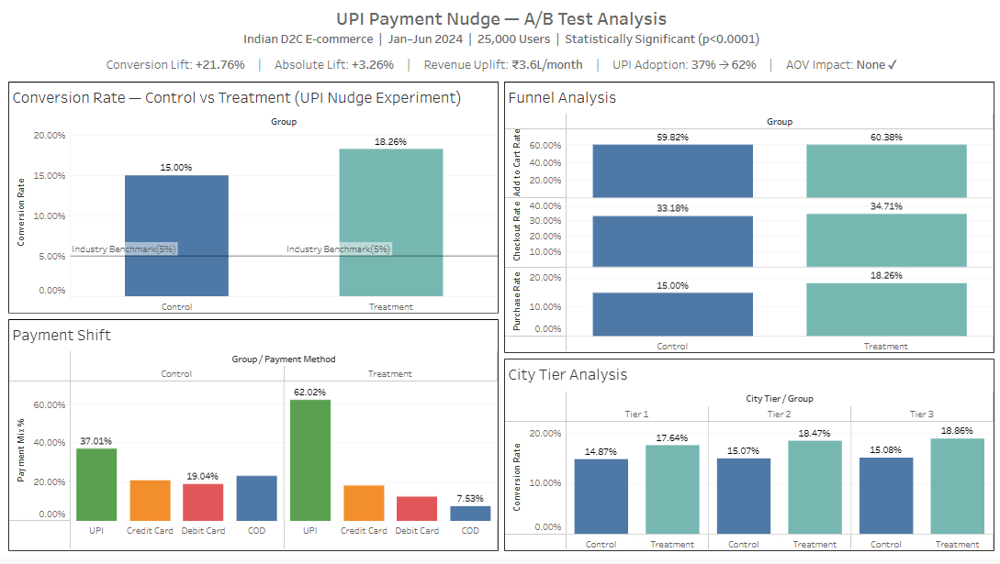

# 🧪 UPI Payment Nudge — A/B Test Analysis
> *Does a UPI cashback nudge at checkout increase conversion for Indian D2C brands?*



---

## 🔗 Quick Links
| Resource | Link |
|----------|------|
| 📊 Live Tableau Dashboard | [View Dashboard](https://prod-in-a.online.tableau.com/#/site/akankshasingh0440-2b03f1b0ee/views/upi_ab_testing/Dashboard1?:iid=1) |
| 📓 Analysis Notebook | [ab_testing.ipynb](ab_testing.ipynb) |
| 📁 Dataset | [upi_ab_test_data.csv](upi_ab_test_data.csv) |

---

## 📌 Project Overview
An end-to-end A/B testing project simulating a real-world experiment for an Indian 
D2C e-commerce brand. The experiment tested whether showing a **"Pay with UPI, 
get 5% cashback"** nudge at checkout improves purchase conversion.

**Experiment Period:** Jan 2024 – Jun 2024  
**Total Users:** 25,000 (12,500 per group)  
**Stack:** Python · SQL (SQLite) · Tableau · Statistical Testing

---

## 🎯 Business Problem
Indian D2C brands face two major checkout problems:
1. **High drop-off at payment step** — users reach checkout but don't complete purchase
2. **High COD dependency** — COD has 30-40% return rates, hurting margins

This experiment tests whether a UPI payment incentive solves both problems simultaneously.

---

## 📊 Key Results

| Metric | Control | Treatment | Δ Change |
|--------|---------|-----------|----------|
| Purchase Rate | 15.00% | 18.26% | **+3.26pp** |
| Relative Lift | — | — | **+21.76%** |
| Checkout→Purchase | 45.21% | 52.62% | **+7.41pp** |
| UPI Adoption | 37.01% | 62.02% | **+25.01pp** |
| COD Usage | 23.15% | 7.53% | **−15.62pp** |
| Avg Order Value | ₹857 | ₹862 | No harm ✅ |
| Revenue/Visitor | ₹129 | ₹157 | **+21.7%** |

### Statistical Validity
| Test | Result |
|------|--------|
| Chi-square p-value | < 0.0001 ✅ |
| 95% Confidence Interval | [14.37%–15.63%] vs [17.59%–18.94%] — no overlap ✅ |
| Power analysis | Required 2,038/group · Had 12,500/group ✅ |
| Guardrail (AOV) | p = 0.5272 — no adverse impact ✅ |

---

## 📊 Dashboard

- 📈 **Conversion Rate — Control vs Treatment** → [Open](conversion_rate.png)  
- 🔽 **Funnel Analysis** → [Open](funnel_analysis.png)  
- 💳 **Payment Method Shift** → [Open](payment_shift.png)  
- 🌆 **City Tier Breakdown** → [Open](city_tier.png)
---

## 🔍 Key Insights

### 1. Nudge impact is funnel-stage specific
Add-to-cart rates were nearly identical (59.82% vs 60.38%) — confirming the 
two groups were truly comparable and the experiment was fair. The entire lift 
happened at the **final payment step**, where checkout-to-purchase drop-off 
fell from 54.79% → 47.38%. This tells product teams exactly where to focus 
optimisation effort — not acquisition, but payment completion.

### 2. Tier 2 & 3 cities responded strongest
| City Tier | Control | Treatment | Lift |
|-----------|---------|-----------|------|
| Tier 1 (Metros) | 14.87% | 17.64% | +2.77pp |
| Tier 2 (Mid cities) | 15.07% | 18.47% | +3.40pp |
| Tier 3 (Small towns) | 15.08% | 18.86% | **+3.78pp** |

Tier 1 users are already habitual UPI users — the nudge adds less value. 
In Tier 2/3 cities where digital payment habits are still forming, the 
cashback incentive provides the extra push needed. **Strategic implication:** 
Always-on UPI nudges in Tier 2/3 markets, optional in metros.

### 3. COD collapse is the hidden win
COD dropped from 23% → 7.5% in the treatment group. Since COD carries 
30-40% return rates in Indian e-commerce, this shift alone could save 
significant operational costs — making the nudge's business case even 
stronger than the conversion numbers suggest.

### 4. Mobile-first effect
| Device | Control | Treatment | Lift |
|--------|---------|-----------|------|
| Mobile | 14.79% | 18.49% | **+3.70pp** |
| Desktop | 15.32% | 17.66% | +2.34pp |
| Tablet | 16.57% | 17.82% | +1.25pp |

UPI is natively mobile — switching to a UPI app from a mobile browser is 
frictionless. **Recommendation:** Prioritise mobile experience for this nudge.

---

## ⚠️ Limitations & Potential Biases

*This section demonstrates analytical maturity — understanding what your 
data cannot tell you is as important as what it can.*

### 1. Synthetic data limitations
This dataset was simulated rather than collected from a live experiment. 
While designed to reflect realistic Indian e-commerce patterns, real-world 
data would have:
- Seasonal effects (festivals, sale events) affecting conversion unpredictably
- User clustering effects (friends referring friends to same group)
- Device-switching behaviour within the same user session

### 2. Novelty effect risk
Users in the Treatment group may have converted at higher rates simply 
because the nudge was new and attention-grabbing. In a real experiment, 
this effect typically fades after 2-3 weeks. A longer experiment duration 
(3-6 months) or a holdback test would confirm whether the lift is sustained.

### 3. Selection bias in payment method analysis
The payment method shift (COD → UPI) is observed only among purchasers. 
We cannot observe the payment preference of non-purchasers — it's possible 
that the nudge disproportionately converted UPI-preferring users, while 
COD-preferring users remained unconverted. This would inflate the observed 
UPI adoption shift.

### 4. Geographic and demographic assumptions
City tier weights (Tier 1: 35%, Tier 2: 42%, Tier 3: 23%) were based on 
general Indian e-commerce estimates. Actual brand-specific traffic distribution 
may differ significantly, affecting the generalisability of tier-wise insights.

### 5. Network effects not modelled
Real e-commerce platforms have network effects — a user's behaviour can 
influence others (social sharing, referrals). A/B testing assumes user 
independence, which may not hold in practice (SUTVA violation).

---

## 💡 Business Recommendation
> Roll out the UPI nudge to **100% of users**, with priority on:
> - 📱 **Mobile traffic** — highest sensitivity to UPI nudge (+3.70pp lift)
> - 🏙️ **Tier 2/3 cities** — strongest relative impact (+3.78pp in Tier 3)
> - 🔄 **COD-heavy segments** — largest operational cost reduction opportunity
>
> **Expected monthly revenue uplift: ₹3.6L/month at current scale**  
> **Additional benefit: Reduced COD returns saving an estimated ₹0.8-1.2L/month**

---

## 🔬 Statistical Methods
| Method | Purpose |
|--------|---------|
| Chi-square test | Test if conversion difference is statistically real |
| 95% Confidence Intervals | Quantify uncertainty around conversion rates |
| Power Analysis (Cohen's h) | Validate sample size adequacy |
| Independent t-test | Guardrail metric (AOV) significance testing |
| Relative & Absolute Lift | Business impact quantification |
| Funnel drop-off analysis | Stage-wise conversion decomposition |
| Segmentation analysis | City tier and device-level effect heterogeneity |

---

## 📁 Repository Structure

```bash
upi-ab-test-analysis/
│
├── ab_testing.ipynb              # Complete analysis notebook
│   ├── Phase 1: Data Generation (Cells 1-7)
│   ├── Phase 2: SQL Funnel Analysis (Cells 8-15)
│   └── Phase 3: Statistical Testing (Cells 16-23)
│
├── upi_ab_test_data.csv          # Simulated dataset (25,000 users)
│
├── dashboard.png                # Dashboard preview
├── conversion_rate.png          # Chart: Conversion rate comparison
├── funnel_analysis.png          # Chart: Funnel drop-off
├── payment_shift.png            # Chart: Payment method shift
├── city_tier.png                # Chart: City tier breakdown
│
└── README.md                    # Project documentation
```
---

## 🗃️ Dataset Schema
| Column | Type | Description |
|--------|------|-------------|
| user_id | string | Unique user identifier (USER_00001 format) |
| session_date | date | Visit date (Jan–Jun 2024) |
| group_name | string | Control or Treatment |
| device | string | Mobile / Desktop / Tablet |
| city_tier | string | Tier 1 / Tier 2 / Tier 3 |
| age_group | string | 18-24 / 25-34 / 35-44 / 45+ |
| returning_customer | binary | 0 = New, 1 = Returning |
| session_duration_mins | float | Time on site in minutes |
| pages_visited | int | Pages viewed before checkout |
| add_to_cart | binary | 1 if added item to cart |
| reached_checkout | binary | 1 if reached checkout page |
| purchased | binary | 1 if completed purchase |
| payment_method | string | UPI / Credit Card / Debit Card / COD / None |
| order_value_inr | float | Purchase value in INR (0 if no purchase) |

---

## 🙋 About
Built by **Akanksha Singh** — Aspiring Data Analyst  
📍 Bengaluru, India  
🔗 [LinkedIn](YOUR_LINKEDIN_URL) · [Tableau Public](YOUR_TABLEAU_URL)

*Tools: Python (pandas, numpy, scipy, statsmodels) · SQL (SQLite) · Tableau Public*
